

# Certificação AWS Cloud Practitioner

* [Assuntos](#assunto)
    - [Pesos](#Pesos)
    - [O que é a computação em nuvem ? ](#nuvem)
    - [vantagens da computação da nuvem](#vantagens)
    - [Computação na nuvem](#nuvem)
    - [Infraestrutura global e Confiabilidade](#infra)
    - [Redes](#redes)
    - [Armazenamento e Bancos de Dados](#banco)
    - [Segurança](#seguranca)
    - [Monitoramento e análise](#Monitoramento)
    - [Definição de preços e suporte](#preco)
    - [Migração e inovação](#migracao)

## Pesos 🏋️
Domínio | % do exame
---------|----------|
Domínio 1: Cloud Concepts | 26%  
Domínio 2: security and compliance | 25%  
Domínio 3: Technology | 33%  
Domínio 4: Billing and pricing | 16%  
TOTAL | 100%  

**[REFERENCIA](https://d1.awsstatic.com/pt_BR/training-and-certification/docs-cloud-practitioner/AWS-Certified-Cloud-Practitioner_Exam-Guide.pdf
)** 

## 1. O que é a computação em nuvem ? ☁️ ☁️ ☁️ 

"É a entrega sob demanda de recursos computacionais, através de uma plataforma de serviços via internet, sem o gerenciamento ativo do usuário".

**[REFERENCIA](https://aws.amazon.com/pt/what-is-cloud-computing/
)** 

 

# 1.1 As 6 vantagens da computação da nuvem na visão da AWS. 🥇

# Save money
"Pare de gastar recursos financeiros na manutenção da infraestrutura e tenha mais foco nos clientes."

# Stopguessing capacity
"Elimina a adivinhação de quanto a infraestrutura precisa, Com a computação em nuvem, você não precisa prever a capacidade de infraestrutura necessária antes de implantar um aplicativo."

# Variable expenses
"Ao adotar uma abordagem de computação em nuvem com o benefício de **despesas variáveis**, as empresas podem implementar soluções inovadoras enquanto economizam custos."

# Economies of scale
"O uso da computação em nuvem permite obter um custo variável inferior ao que você consegue por conta própria."

# Increase speed and agility
"Mais facilidade na hora de usar o serviço em poucos cliques. "

# Go global
"Facilidade em disponibilizar o serviço em varias partes no globo."

**[REFERENCIA](https://docs.aws.amazon.com/pt_br/whitepapers/latest/aws-overview/six-advantages-of-cloud-computing.html
)** 

# 1.2 Tipos de clouds
## Temos 3 tipos de clouds!

* IAAS:
Infrastructure as a service (infraestrutura como serviço).   Ex: Utilizamos o serviço das máquinas ec2 para montar servidores virtuais, utilizando rede, armazenamento e processamento. A aws oferece o hardware das máquinas e todo o maquinario por de trás do dashboard, enquanto o usúario configura o que deseja.

* PAAS:
plataform as a service (plataforma como serviço), Não é preciso gerenciar a infraestrutura subjacente (geralmente hardware e sistemas operacionais), e você pode focar na implantação e no gerenciamento de suas aplicações.

* SAAS:
SaaS – software as a service (software como serviço). Quando utilizamos o software: Amazon CloudFront, Amazon Detective,Amazon DocumentDB etc.

  <a>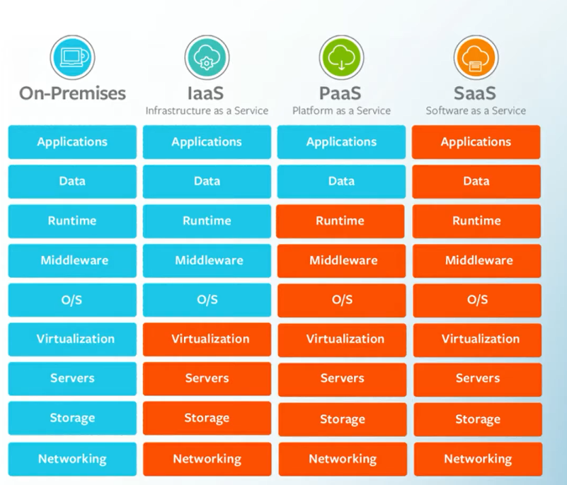</a>

**[REFERENCIA](https://aws.amazon.com/pt/types-of-cloud-computing/
)**

# 2. COMPUTAÇÃO NA NUVEM 🖥 ☁️

"O Amazon EC2 é um serviço que disponibiliza uma capacidade computacional segura, representado por uma instância redimensionável na Nuvem."

### CARACTERÍSTICAS
* amazon EC2 Elastic Compute Cloud
* Modelo Infraestrutura como Serviço
* Alugar máquinas virtuais (EC2)
* Armazenar dados em volumes virtuais (EBS)
* Distribuir a carga de trabalho (ELB)
* Escalar o serviço de acordo com a demanda (ASG)
* Modelo Computacional Infraestrutura como Serviço
* Ambiente operacional Windows, MacOS e Linux
* Cobrança por hora ou segundo (mínimo de  60 segundos)

**[REFERENCIA](https://aws.amazon.com/pt/ec2/
)**
# Tipos de instâncias

FAMÍLIA | OTIMIZADO | IDEAL PARA
---------|----------|---------|
`A, T, M, MAC`      | Uso geral | Servidores de web, homologação e repositórios de código
`C`      | Computação |Modelagem científica, servidores de jogos, servidor de anúncios, machine learning
`R, X, Z`      | Memória | Cargas de trabalho que processam grandes conjuntos de dados na memória.
`I, D, H`      | Processamento | Executar funçoes, como cálculos de números de ponto flutuante, processamento de gráficos.
`I, D, H`      | Armazenamento | Cargas de trabalho qeu requerem uso intensivo de disco (IOPS)

**[REFERENCIA](https://aws.amazon.com/pt/ec2/instance-types/)**

## ✨ Amazon EC2 Launch Types

Launch | Específico | Preço | Útil 
---------|----------|---------|---------
SOB DEMANDA/On-Demand Instances | Cobrança sobre o que usar (por hora OU por segundo). Sem compromisso de uso (anos). Sem pagamento adiantado. Pode aumentar ou diminuir a capacidade computacional. | Alto custo se usado por longo prazo | Cargas de trabalho de curtoprazo, validar hipóteses, com pico de utilização previsível, testar e experimentar um ambiente.
INSTANCIAS RESERVADAS | Aplicações que exigem capacidade reservada comprometimento de uso da instância por um período de 01 ou 03 anos. | possui pagamento integral/parcial e adiantado. Até 75% desconto comparação instancias por demanda | Ambiente de produção que foi testado e não será modificado, aplicação que precisa ter estado constante; Excelente para banco de dados.
HOST DEDICADO | Hardware dedicado. Servidor físico EC2 exclusivo para cumprir requisitos de conformidade. Visibilidade de soquetes, núcleos. IDs de host. Comprometimento por um período de 03 anos. Pode ser comprado sob demanda de horas | se optar por reservar, até 70% desconto em comparação com instâncias por demanda | Vincular licenças de software como Windows Server, AWS Server e SUSE Linux Enterprise Server.
INSTANCIA DEDICADA | Hardware dedicado Pode compartilhar o hardware com outras instancias, na mesma conta. Não tem controle sobre o posicionamento da instancia (você só pode movimentar hardware se interromper e reiniciar); Comprometimento por um período de 03 anos
INSTANCIAS SPOT | são terminadas quando o preço do spot, é maior do que o preço que você estabeleceu para pagar. terminate =(preço spot da AWS > seu preço) | Até 90% desconto comparação instancias por demanda | Quando você tem urgência de grande capacidade computacional, workloads que podem parar e serem iniciados novamente, trabalhos em iote, análise de dados, processamento de imagens.

**[REFERENCIA](https://docs.aws.amazon.com/pt_br/AWSEC2/latest/UserGuide/instance-purchasing-options.html)**

## Savings Plans do Amazon EC2
permite reduzir os custos de computação ao haver o compromisso com uma quantidade consistente de uso de computação por um período de um ou três anos. Esse compromisso resulta em economias de até 72% em relação aos custos de instâncias sob demanda.
**[REFERENCIA](https://aws.amazon.com/pt/savingsplans/)**

## Amazon EC2 Auto Scaling

"O Amazon EC2 Auto Scaling permite que você adicione ou remova automaticamente instâncias do Amazon EC2 em resposta à alteração da demanda do aplicativo."

- No Amazon EC2 Auto Scaling, há duas abordagens disponíveis: scaling dinâmico e scaling preditivo.

* O scaling dinâmico responde às alterações na demanda. 
* O scaling preditivo programa automaticamente o número correto de instância do Amazon EC2 com base na demanda prevista.

  <a>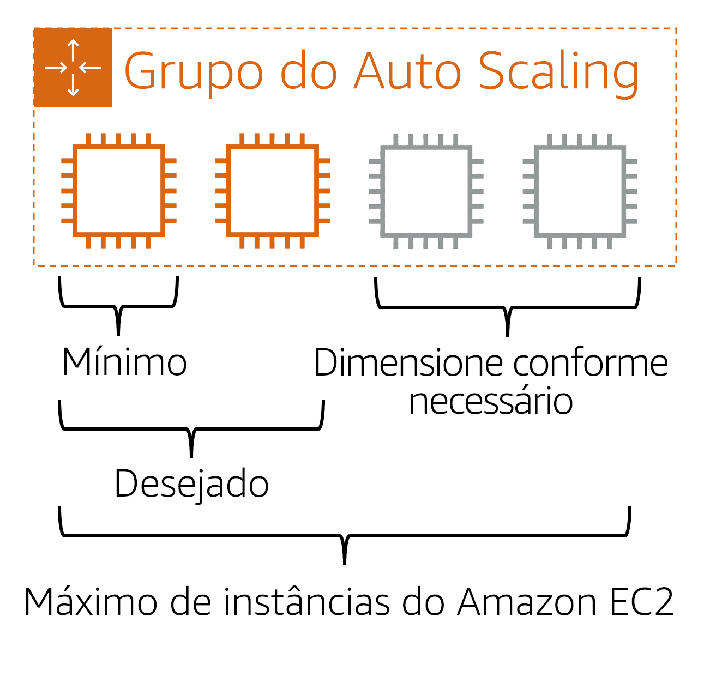</a>

**[REFERENCIA](https://aws.amazon.com/pt/ec2/autoscaling/)**
## Escalabilidade
almenta os recursos computacionais como: RAM,CPU etc.

## Elasticidade 
almenta os números de intancias(máquinas)

Serviços Elásticos: Amazon EC2, Elastic Load Balacing, AWS Elastic Beanstalk, Amazon Elastic Cache

OBS:
* Definir uma quantidade mínima, desejável e máxima de instancias
* Scale out (aumentar com as demandas) e Scale in (diminuir quando a demanda deixa de ocorrer)
* Auto Scaling Group é gratuito, voce paga apenas pelas instancias que estao sendo executadas

## Elastic Load Balancing
"O Elastic Load Balancing é o serviço AWS que distribui automaticamente o tráfego de entrada de aplicativos entre vários recursos, como instâncias do Amazon EC2, conteineres, endereços IP e Funções Lambda"

- TIPOS DE LOAD BALANCER
  - Application Load Balancer,
  - Network Load Balancer, 
  - Gateway Load Balancer, 
  - Classic Load

= | APPLICATION LOAD BALANCER | NETWORK LOAD BALANCER | GATEWAY LOAD BALANCER | CLASSIC LOAD BALANCER
---------|----------|---------|---------|---------|
Protocolos | HTTP, HTTPS | TCP, UDP, TLS | IP(GENEVE) porta 6081 | HTTP, HTTPS, TCP, UDP, TLS
Plataforma | Amazon VPC |Amazon VPC | Amazon VPC | Amazon VPC, Rede EC2-CLASSIC
Camada OSI | 7 | 4 | 3 | 7 OU 4
REcomendável | Amazon EC2, Conteineres, Funções Lambda, Endereções IP | Amazon EC2, Micro Serviço e Conteineres | Gerenciar virtual appliance como firewall e inpeção de pacote, no Amazon EC2 | Em breve será descontinuado

**[REFERENCIA](https://aws.amazon.com/pt/elasticloadbalancing/)**

## Amazon Simple Notification Service (Amazon SNS)
"O Amazon Simple Notification Service (Amazon SNS) é um serviço de publicação/assinatura."

**[REFERENCIA](https://aws.amazon.com/pt/sns/)**

## Amazon Simple Queue Service (Amazon SQS)
"O Amazon Simple Queue Service (Amazon SQS) é um serviço de enfileiramento de mensagens que permite o desacoplamento e a escalabilidade de microsserviços, sistemas distribuídos e aplicações sem servidor." 

**[REFERENCIA](https://aws.amazon.com/pt/sqs/)**

## AWS Lambda
"O AWS Lambda é um serviço que permite a execução de códigos sem a necessidade de provisionar ou gerenciar servidores.
Permite que voce execute códigos sem provisionar ou gerenciar servidores, pagando apenas pelo número de solicitações e pelo tempo de computação que voce utilizar."

OBS: 
* serviço serveless e gerenciado pela AWS
* AWS Lambda dimensiona suas aplicações 
* voce pode otimizar o tempo de execuçao e o tamanho de memoria
* cobrança por númeo de solicitacoes de duas funcoes e pela duracao por cada milissegundo que leva para que seu codigo seja executado

**[REFERENCIA](https://aws.amazon.com/pt/lambda/)**

## Amazon Elastic Container Service (Amazon ECS)
"É um sistema de gerenciamento de contêineres altamente dimensionável e de alto desempenho que permite executar e dimensionar aplicativos em contêineres na AWS."

**[REFERENCIA](https://aws.amazon.com/pt/ecs/)**

## Amazon Elastic Kubernetes Service (Amazon EKS)
"É um serviço totalmente gerenciado que você pode usar para executar o Kubernetes na AWS."

**[REFERENCIA](https://aws.amazon.com/pt/eks/)**

## AWS Fargate
"O AWS Fargate é um mecanismo de computação sem servidor para contêineres. Ele funciona com o Amazon ECS e o Amazon EKS.
Com o AWS Fargate, você não precisa provisionar ou gerenciar servidores." 

**[REFERENCIA](https://aws.amazon.com/pt/fargate/)**

# 3. INFRAESTRUTURA GLOBAL E CONFIABILIDADE 🛰 🏭

Uma região é a disponibilização de uma coleção de recursos AWS em uma localização geográfica, sendo ele composto por um conjunto de zonas de disponibilidade(um conjunto de data centers em uma localização geográfica.)

ZONA DE DISPONIBILIDADE: Uma zona de disponibilidade é um conjunto de datacenters que estão na mesma REGIÃO, porém separados por uma distancia significativa, atuando de forma independente em caso de falha de uma zona.

Pontos de presença, Edge locations ou local de borda é: uma infraestrutura de servidores, localizado próximo de uma ZD, que armazena os dados mais solicitados no cache, para entregar com menor latência uma requisição de consulta.

OBS:
são utilizados como cache de dados para distribuição de conteúdo.

**[REFERENCIA](https://docs.aws.amazon.com/pt_br/AmazonRDS/latest/UserGuide/Concepts.RegionsAndAvailabilityZones.html)**

## AWS Elastic Beanstalk
"Você fornece definições de **código** e configuração, e o Elastic Beanstalk implanta os recursos necessários para executar as seguintes tarefas:"

* Balancear carga
* Dimensionar de forma automática
* Monitorar a integridade do aplicativo
* Ajustar capacidade
* Auto Scaling Group (ASG)
* Alta disponibilidade (Multi-az)
* Upload código arquivo <512Mb ou Upload via URL Buckeat S3
* Plataforma como Serviço (PaaS)

**[REFERENCIA](https://aws.amazon.com/pt/elasticbeanstalk/)**

## AWS CloudFormation
"Você pode considerar sua infraestrutura como código. 
crie frequentemente a infraestrutura e os aplicativos sem precisar executar ações manuais ou criar scripts personalizados." 

**[REFERENCIA](https://aws.amazon.com/pt/cloudformation/)**

# 4. REDES 📡

## AMAZON VPC
"O Amazon VPC é uma sessão isolada logicamente na nuvem AWS, que permite customizar uma rede virtual e executar recursos, em uma ambiente com controle total"

**[REFERENCIA](https://aws.amazon.com/pt/vpc/)**

## AWS Direct Connect
"O AWS Direct Connect é um serviço que permite estabelecer uma conexão privada dedicada entre seu data center e uma VPC."

A conexão privada que o AWS Direct Connect fornece ajuda você a reduzir os custos de rede e a aumentar a quantidade de largura de banda que pode trafegar pela sua rede.

  <a>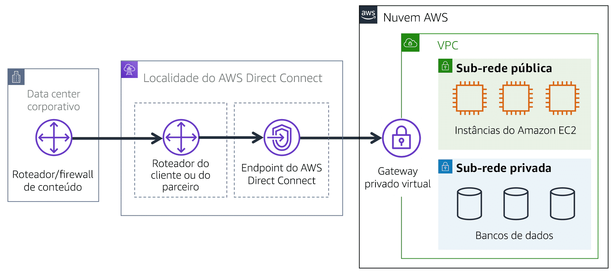</a>

**[REFERENCIA](https://aws.amazon.com/pt/directconnect/)**

## Gateway da internet X Gateway privado virtual

Para permitir que o tráfego público da internet acesse sua VPC, é preciso anexar um **gateway da internet** à VPC.

  <a>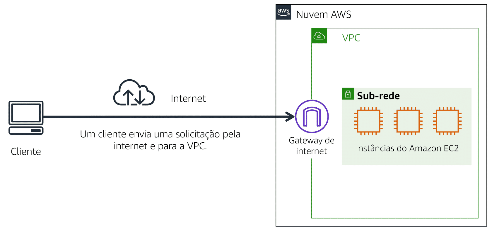</a>

**[REFERENCIA](https://docs.aws.amazon.com/pt_br/vpc/latest/userguide/VPC_Internet_Gateway.html)**

Para acessar recursos privados em uma VPC, você pode usar um **gateway privado virtual**. 

  <a>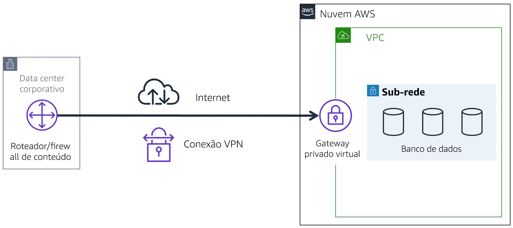</a>

**[REFERENCIA](https://docs.aws.amazon.com/pt_br/directconnect/latest/UserGuide/virtualgateways.html)**

OBS:
Uma sub-rede é uma seção de uma VPC na qual você pode agrupar recursos com base em necessidades operacionais ou de segurança. As sub-redes podem ser públicas ou privadas. 

  <a>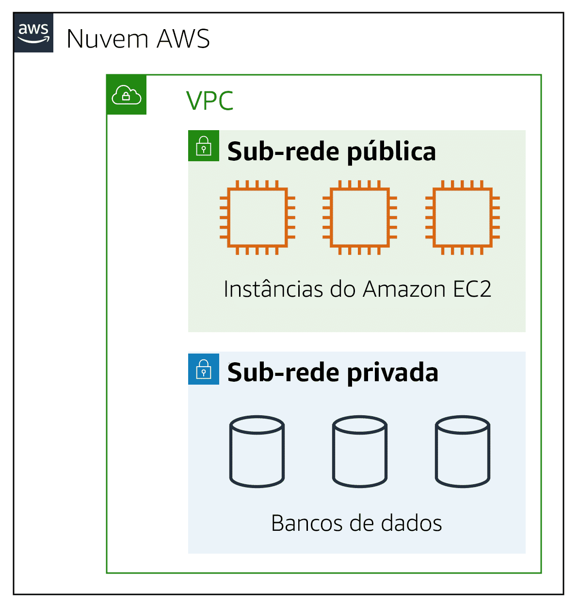</a>

## Lista de controle de acesso (ACL) de rede.
"Uma lista de controle de acesso (ACL) de rede é um firewall virtual que controla o tráfego de entrada e saída no nível de sub-rede."

**[REFERENCIA](https://docs.aws.amazon.com/pt_br/AmazonS3/latest/userguide/acl-overview.html)**

"Uma lista de controle de acesso (ACL) de rede permite ou não determinado tráfego de entrada ou de saída no nível da sub-rede."

# Filtragem de pacotes stateless
As ACLs de rede executam a filtragem de pacotes stateless. Elas não se lembram de nada e verificam os pacotes que atravessam a fronteira da sub-rede em todos os sentidos: entrada e saída.

# Filtragem de pacotes stateful
Os grupos de segurança fazem a filtragem de pacotes stateful. Eles se lembram de decisões anteriores tomadas para pacotes recebidos.

## Grupos de segurança

Um grupo de segurança é um firewall virtual que controla o tráfego de entrada e saída de uma instância do Amazon EC2.

Por padrão, um grupo de segurança nega todo o tráfego de entrada e permite todo o tráfego de saída. 

**[REFERENCIA](https://docs.aws.amazon.com/pt_br/AWSEC2/latest/UserGuide/ec2-security-groups.html
)**

## Amazon Route 53
"é um serviço web de DNS. Oferece aos desenvolvedores e empresas uma maneira confiável de rotear os usuários finais para aplicativos da internet hospedados na AWS."

  

### REGISTROS COMUNS

URL | IP | REGISTRO/RECORD | TIPO
---------|----------|---------|---------
www.google.com | 216.239.38.120 | A | IPv4
www.google.com | 0:0:0:0:0:ffff:d8ef:2678 |AAAA |IPv6
search.google.com | www.google.com | CNAME | Hostname para Hostname
exemplo | Recurso AWS | ALIAS | ELB, CloudFront, S3, DRS...

**[REFERENCIA](https://aws.amazon.com/pt/route53/)**

# 5. Armazenamento e Bancos de Dados 📊 🗂 💻

## Amazon Elastic Block Store (Amazon EBS)
"é um serviço que fornece volumes de armazenamento a nível de bloco que você pode usar com instâncias do Amazon EC2. Se você interromper ou encerrar uma instância do Amazon EC2, todos os dados no volume do EBS anexo permanecerão disponíveis."

**[REFERENCIA](https://aws.amazon.com/pt/ebs/)**

## Snapshots do Amazon EBS
"Um snapshot do EBS é um backup incremental. Isso significa que o primeiro backup de um volume copia todos os dados."

  <a>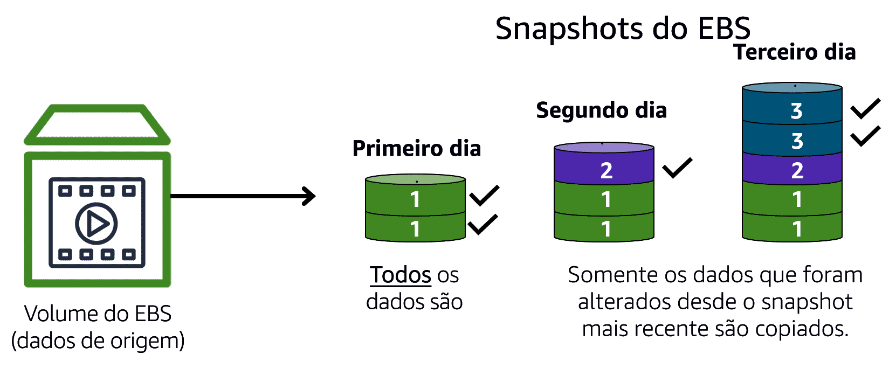</a>

**[REFERENCIA](https://docs.aws.amazon.com/pt_br/AWSEC2/latest/UserGuide/EBSSnapshots.html)**

## Amazon Simple Storage Service (Amazon S3)
"É um serviço gerenciado de armazenamento e recuperação  de objetos, respondendo com escalabilidade, disponibilidade, segurança e performance."

OBS:
* Armazenamento virtualmente ilimitado
* Compartilhar arquivos ou criar um website estático
* Armazenar snaphots, backups, gerar um armazenamento híbrido do seu ambiente on-premises
* Repositório de data lakes e análise de big data
* Baixa latencia e alta velocidade
* Durabilidade 99,999999999(onze noves)
* O Amazon S3 oferece espaço de armazenamento ilimitado. 
* O tamanho máximo de arquivo para um objeto no Amazon S3 é de 5 TB.

**ARMAZENAMENTO = BUCKETS | ARQUIVOS = OBJETOS | SUB-PASTAS = PREFIXOS**

- SOBRE OS OBJETOS
  - Tamanho máximo objeto 5 TB
  - Upload > 5 GB use multi-part upload
  - metadata(Chave e valor por sistema e usuário)
  - tags(chave e valor por usuário)
  - Versionamento de objetos

## Classes de armazenamento do Amazon S3

| = |S3 Standard | S3 Intelligent Tiering |(S3 Standdar-IA) | S3 One Zone -IA | S3 Glacier | S3 Glacier Deep Archive
---------|----------|---------|---------|---------|---------|---------
Bom para | Uso geral | Uso geral e movimentação automática | Menor frenquencia e idela para backup | Menor frenquencia, mas só uma ZD | Arquivar dados | Retenção longo prazo > 7 anos
Ciclo Vida | Zero | <=30 | >=30 | >=30 | >=90 | >=180
durável | 99,999999999% | 99,999999999% | 99,999999999% | 99,999999999% | 99,999999999% | 99,999999999%
Disponível | (11 9's) | (11 9's) | (11 9's) | (11 9's) | (11 9's) | (11 9's) | (11 9's)
Zona Dispo | >=3 | >=3 | >=3 | 1 | >=3 | >=3
SLA | 99,9% | 99% | 99% | 99% | 99,9% | 99,9%
Recuperação | Imediata | Imediata | Imediata | Imediata | Imediata | Imediata
---
- S3 Standar
  - Projetado para dados acessados com frequência
  - Armazena dados em um mínimo de três Zonas de Disponibilidade
  - 99.999999999 de durabilidade

O S3 Standard fornece alta disponibilidade para objetos. Isso o torna uma boa escolha para diversos casos de uso, como sites, distribuição de conteúdo e análise de dados. O S3 Standard tem um custo mais alto do que outras categorias de armazenamento para dados acessados com pouca frequência e armazenamento de arquivamento.
---
- Standard-Infrenquent Access (S3 Standdar-IA)
  - Ideal para dados com pouca frequência de acesso
  - Semelhante ao S3 Standard, mas com um preço de armazenamento mais baixo e um preço de recuperação mais alto

O S3 Standard-IA é ideal para dados acessados com pouca frequência, mas que precisam ter alta disponibilidade para quando necessário. O S3 Standard e o S3 Standard – IA armazenam dados em um mínimo de três Zonas de Disponibilidade. O S3 Standard – IA fornece o mesmo nível de disponibilidade do S3 Standard, mas com um preço de armazenamento mais baixo e um preço de recuperação mais alto.
--- 

- One Zone-Infrequent Access (S3 One Zone - IA)
  - Armazena dados em uma única Zona de Disponibilidade
  - Tem um preço de armazenamento menor do que o S3 Standard – IA
---

- Intelligent Tiering
  - Ideal para dados com padrões de acesso desconhecidos ou em alteração
  - Requer uma pequena taxa mensal de monitoramento e automação por objeto

Na categoria de armazenamento S3 Intelligent-Tiering, o Amazon S3 monitora os padrões de acesso dos objetos. Se você não acessou um objeto por 30 dias consecutivos, o Amazon S3 o move automaticamente para o nível de acesso pouco frequente S3 Standard – IA. Se você acessar um objeto no nível de acesso pouco frequente, o Amazon S3 o move automaticamente para o nível de acesso frequente S3 Standard.
---
- Glacier
  - Armazenamento de baixo custo projetado para arquivamento de dados
  - Capaz de recuperar objetos em poucos minutos a horas

O S3 Glacier é uma categoria de armazenamento de baixo custo, ideal para o arquivamento de dados. Por exemplo, você pode usar essa categoria para armazenar registros de clientes arquivados ou arquivos de fotos e vídeos mais antigos.
---
- S3 Glacier Deep Archive
  - Categoria de armazenamento de objetos com menor custo, ideal para arquivamento
  - Capaz de recuperar objetos em 12 horas

Ao decidir entre o Amazon S3 Glacier e o Amazon S3 Glacier Deep Archive, considere a prontidão com que você precisa recuperar objetos arquivados. É possível recuperar objetos armazenados na categoria de armazenamento S3 Glacier de alguns minutos a algumas horas. Em comparação, é possível recuperar objetos armazenados na categoria de armazenamento S3 Glacier Deep Archive em até 12 horas.
---

**[REFERENCIA](https://aws.amazon.com/pt/s3/)**
---
## Amazon Elastic File System (Amazon EFS)

"é um sistema de arquivos escalável usado com os serviços de nuvem AWS e recursos locais. À medida que você adiciona e remove arquivos, o Amazon EFS expande e retrai automaticamente. Ele pode dimensionar sob demanda para petabytes sem interromper os aplicativos." 
  -  ideal para casos de uso em que um grande número de serviços e recursos precisam acessar os mesmos dados ao mesmo tempo.

**[REFERENCIA](https://aws.amazon.com/pt/efs/)**

## Amazon Relational Database Service (Amazon RDS)

"O Amazon Relational Database Service (Amazon RDS) é um serviço que permite executar bancos de dados relacionais na nuvem AWS."
* alta disponibilidade automática, recuperação fornecida
* Cliente é propriétario dos dados
* Cliente é propriétario dos schema
* Cliente controla a rede
* Automatiza tarefas como provisionamento de hardware, configuração de banco de dados, patch e backups.
**[REFERENCIA](https://aws.amazon.com/pt/rds/)**
---
## Amazon Aurora
"O Amazon Aurora é um banco de dados relacional de nível empresarial."
- cinco vezes mais rápido do que o MYSQL
- três vezes mais rápido do que os bancos de dados PostgreSQL comuns
- alta disponibilidade
- Replicação de seis copias em três Zonas de Disponibilidade
- backup contínuo

Considere o Amazon Aurora se suas cargas de trabalho exigem alta disponibilidade. Ele replica seis cópias de seus dados em três Zonas de Disponibilidade e faz backup contínuo de seus dados para o Amazon S3.
**[REFERENCIA](https://aws.amazon.com/pt/rds/aurora/)**

---
## Amazon DynamoDB
*  banco de dados não relacional
* O DynamoDB é sem servidor, o que significa que você não precisa provisionar, aplicar patches ou gerenciar servidores. 

Você também não precisa instalar, manter ou operar o software.\
* Auto Scaling
* Chave-valor
* Capacidade de produção massíva
* Potencial de tamanho de PB
* Acesso a API granular
**[REFERENCIA](https://aws.amazon.com/pt/dynamodb/)**

## Amazon RedShift
"O Amazon Redshift é serviço de data warehouse que você pode usar para análise de big data. Ele oferece a capacidade de coletar dados de muitas fontes além de ajudar a entender relações e tendências em todos os seus dados."
**[REFERENCIA](https://aws.amazon.com/pt/redshift/)**

## AWS Database Migration Service (AWS DMS)
"O AWS Database Migration Service (AWS DMS) permite migrar bancos de dados relacionais e não relacionais e outros tipos de armazenamentos de dados."

  - O banco de dados de origem permanece totalmente operacional durante a migração
  - Minimizando o tempo de inatividade das aplicações que dependem desse banco de dados.
  - Os bancos de dados de origem e edestino não precisam ser do mesmo tipo.
**[REFERENCIA](https://aws.amazon.com/pt/dms/)**

## Amazon DocumentDB
"O Amazon DocumentDB é um serviço de banco de dados de documentos compatível com cargas de trabalho do MongoDB. (MongoDB é um programa de banco de dados de documentos.)"
**[REFERENCIA](https://aws.amazon.com/pt/documentdb/)**

## Amazon Neptune
O Amazon Neptune é um serviço de banco de dados de grafo.

Você pode usar o Amazon Neptune para criar e executar aplicativos que funcionam com conjuntos de dados altamente conectados, como mecanismos de recomendação, detecção de fraudes e gráficos de conhecimento.
**[REFERENCIA](https://aws.amazon.com/pt/neptune/)**

## Amazon Quantum Ledger DAtabase (Amazon QLDB)
"O Amazon Quantum Ledger Database (Amazon QLDB) é um serviço de banco de dados ledger.
Mantenha um log imutável e criptografável das mudanças de dados.
Você pode usar o Amazon QLDB para revisar um histórico completo de todas as alterações feitas nos dados do aplicativo.
**[REFERENCIA](https://aws.amazon.com/pt/qldb/)**

## Amazon Managed Blockchain
O Amazon Managed Blockchain é um serviço para criar e gerenciar redes de blockchain com estruturas de código aberto.

O Blockchain é um sistema de registro distribuído que permite que várias partes executem transações e compartilhem dados sem uma autoridade central.
**[REFERENCIA](https://aws.amazon.com/pt/managed-blockchain/)**

## Amazon ElastiCache
O Amazon ElastiCache é um serviço que adiciona camadas de cache sobre seus bancos de dados para ajudar a melhorar os tempos de leitura de solicitações comuns.

Ele é compatível com dois tipos de armazenamentos de dados: Redis e Memcached.
**[REFERENCIA](https://aws.amazon.com/pt/elasticache/)**

## Amazon DynamoDB Accelecerator
O Amazon DynamoDB Accelerator (DAX) é um cache em memória para o DynamoDB.

Ele ajuda a melhorar os tempos de resposta de milissegundos para microssegundos.
**[REFERENCIA](https://aws.amazon.com/pt/dynamodb/dax/)**

# 6. SEGURANÇA 👮‍♀️ 👮

## 6.1 Modelo de responsabilidade compartilhada

  <a>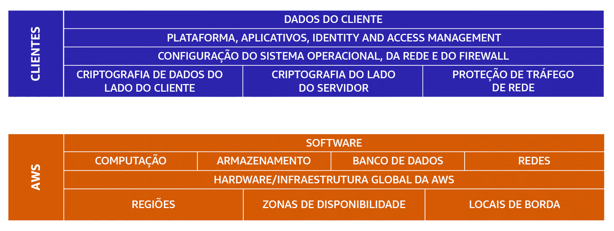</a>

## AWS Identity and Access Management (IAM)

permite que você gerencie o acesso aos serviços e recursos AWS com segurança.

obs:
- Usuários possuem credencias permanentes e funções possuem credenciais temporárias 
- Usuários root NÃO devem ser compartilhados
- Use o least privilege principle nos usuários
- Documentos JSON definem as permissões de acesso
- Grupos contém outros usúarios, mas NÃO podem conter outros grupos.

## Usuários
Pessoa ou serviço, com credenciais permanentes não compartilhe o usuário root & use o least privilege

## Grupos do IAM
Um grupo do IAM é um conjunto de usuários do IAM. Ao atribuir uma política do IAM a um grupo, todos os usuários do grupo recebem permissões especificadas pela política.
  - Grupos não podem conter outros grupos

## Funções do IAM
Uma função do IAM é uma identidade que você pode assumir para obter acesso temporário a permissões.

  - Uma função do IAM é uma identidade que você pode assumir para obter acesso temporário a permissões.

**[REFERENCIA](https://aws.amazon.com/pt/iam/)**

## AWS Organizations
"AWS Organizations permite que voce gerencie e controle seu ambiente de maneira centralizada"

- OBS
  - AWS Organizations é um serviço Global
  - Permite gerenciar múltiplas contas AWS
  - Uma conta principal (Master Account)
  - APi disponível para criação de contas
  - Restrição das contas usando SCP (Service Control Police)
  - consolidar e gerenciar múltiplas contas AWS em um local central.
  - No AWS Organizations, você pode agrupar contas em unidades organizacionais (UO) para facilitar o gerenciamento de contas com requisitos de negócios ou segurança semelhantes.

**[REFERENCIA](https://aws.amazon.com/pt/organizations/)**

## políticas de controle de serviço (SCPs).

As SCPs permitem que você coloque restrições nos serviços AWS, recursos e ações individuais de API que os usuários e funções em cada conta podem acessar.
**[REFERENCIA](https://docs.aws.amazon.com/pt_br/organizations/latest/userguide/orgs_manage_policies_scps.html)**

## AWS Artifact

O AWS Artifact é um serviço que fornece acesso sob demanda a relatórios de segurança e conformidade da AWS e a contratos on-line selecionados. O AWS Artifact tem duas seções principais: AWS Artifact Agreements e o AWS Artifact Reports.

  - AWS Artifact Agreements
No AWS Artifact Agreements, você pode revisar, aceitar e gerenciar contratos para uma conta individual e para todas as suas contas no AWS Organizations.

  - AWS Artifact Reports
O AWS Artifact Reports fornece relatórios de conformidade por auditores terceirizados. Esses auditores testaram e verificaram se a AWS está em conformidade com diversas normas e regulamentações de segurança globais, , regionais e específicas do setor. 

**[REFERENCIA](https://aws.amazon.com/pt/artifact/)**

## Ataques de negação de serviço

## AWS Shield
O AWS Shield é um serviço que protege aplicativos contra ataques DDoS. O AWS Shield oferece dois níveis de proteção: Standard e Advanced.

OBS: 
  - AWS SHILD é para mitigar ataques DDoS
  - Stardard é gratuito para todos
  - Advanced é pago, suporte 24x7 e possui proteção extra em determinados serviços

**[REFERENCIA](https://aws.amazon.com/pt/shield/)**

## AWS Shield Standard
"O AWS Shield Standard protege automaticamente todos os clientes AWS sem nenhum custo. Ele protege seus recursos AWS contra os tipos de ataques DDoS mais comuns e frequentes."

- Gratuito para todos os clintes AWS
- Proteção SYN/UDP Floods, Reflection Attacks
- Outros ataques na camada 3 e camada 4

## AWS Shield Advanced
"é um serviço pago que fornece diagnósticos detalhados de ataques e a capacidade de detectar e mitigar ataques elaborados de DDoS."

OBS:
- Serviço pago
- suporte 24x7
- Proteção extra nos serviços: Amazon EC2, (ELB), Amazon CloudFront, AWS Global Accelerator e Route 53.  

## AWS Key Management Service (AWS KMS)
"permite que você execute operações de criptografia pelo uso de chaves de criptografia."

## AWS WAF
"é um firewall de aplicativo web que permite monitorar solicitações de rede que entram em seus aplicativos web."
  - OBS: Trabalha em conjunto com o Amazon CloudFront e balanceador de carga de aplicativo.

## Amazon Inspector
"O Amazon Inspector **ajuda a melhorar a segurança e a conformidade** dos aplicativos executando avaliações de segurança automatizadas. Ele verifica os aplicativos quanto a vulnerabilidades de segurança e desvios das práticas recomendadas de segurança, como acesso aberto a instâncias do Amazon EC2 e instalações de versões de software vulneráveis." 
**[REFERENCIA](https://aws.amazon.com/pt/inspector/)**

## Amazon GuardDuty
"O Amazon GuardDuty é um serviço que fornece **detecção** inteligente de ameaças para sua infraestrutura e seus recursos AWS. Ele identifica ameaças monitorando continuamente a atividade da rede e o comportamento da conta no seu ambiente AWS.
**[REFERENCIA](https://aws.amazon.com/pt/guardduty/)**

# 7. Monitoramento e análise 👨‍💻 📟

## Amazon CloudWatch
"O Amazon CloudWatch é um serviço de monitoramento de desemenho dos recursos e dos aplicativos que voce executa no seu ambiente"

- Visualizar as aplicações e a sua infraestrutura em um único local 
- Acessar um Dasboard automático
- Criar o seu Dasboard(painel) pernonalizado com os serviços e métricas que deseja acompanhar
- Configurar alarmes visuais do ambiente

__Coletar -> Monitorar -> Atuar -> Analisar__
---
- Coletar 

  - Coleta Métricas e Logs
  - Recursos e Serviçõs na Nuvem e on-premises
  - Métrica padrão 5 minutos
  - Métrica detalhada ($$$) por minuto
- Monitorar
  - Visualizar as aplicaçõs e a sua infraestrutura em um único local
  - Acessar um Dashboard automático
  - Criar o seu DashBoard(painel) personalizado, com os serviços e métricas que deseja acompanhar
  - Configurar alarmes visuais do ambiente
- Atuar
  - Criar alarmes para atuar como gatilho, baseado nas métricas de uso e desempenho
  - Opções do gatilho: amostra, %, valor máximo, mínimo, etc.
  ALARM ACTION:
  - Auto Scaling Group: Aumentar ou diminuir o número de instancias no amazon EC2
  - Amazon SNS: Enviar notificações para um SNS Topic, para que as assinantes recebam um e-mail.
- Analisar
  - Analisar em tempo real o seu ambiente, em segundos ou posterior com até 15 meses de armazenamento dos logs
  - Análise de alarmes possui tres estados:  
  OK - tudo bem  
  INSUFFICIENTE_DATA - COLETANDO DADOS  
  ALARM - algo ruim aconteceu ou para indicar que a sua métrica foi atingida.

 **[REFERENCIA]( https://aws.amazon.com/pt/cloudwatch/)**

## AWS CloudTrail
"O AWS CloudTrail é um serviço que possibilita governança, conformidade, auditoria operacional e auditoria riscos em sua conta AWS."

- OBS:
  - registra as chamadas de API
  - visualizar um histórico completo de atividades do usuário e chamadas de API de seus aplicativos e recursos. 

**[REFERENCIA](https://aws.amazon.com/pt/cloudtrail/)**

## CloudTrail Insights
Esse recurso opcional permite que o CloudTrail detecte automaticamente atividades de API incomuns em sua conta AWS. 

**[REFERENCIA](https://docs.aws.amazon.com/pt_br/awscloudtrail/latest/userguide/logging-insights-events-with-cloudtrail.html)**

## AWS Config
"é um serviço que permite acessar, auditar e avaliar as configurações dos recursos da aws."

- Funcionamento:
  - Há acesso irrestrito via SSH nos meus grupos de segurança?
  - Meus Buckets S3 estão com acesso aberto ao público ?
  - Como minha configuração ALB mudou ao longo do tempo ?

**[REFERENCIA](https://aws.amazon.com/pt/config/)**

- OBS
  - AWS Config é regional
  - Auxilia na auditoria das alterações dos recursos para compliance
  - Mantém histórico das alterações e armazena em um bucket S3 para posterior análise
  - Notificações de alterações são enviadas com o Amazon SNS e disponibilizadas no DashBoard(painel) do AWS Config

## AWS Trusted Advisor
"é um serviço web que inspeciona seu ambiente AWS e faz recomendações em tempo real de acordo com as práticas recomendadas da AWS."

 - faz recomendações de práticas recomendadas em cinco categorias:    
    - otimização de custos,   
    - desempenho, segurança, 
    - tolerância a falhas,
    - limites de serviço.

  

 **[REFERENCIA](https://aws.amazon.com/pt/premiumsupport/technology/trusted-advisor/
)**

# 8. Definição de preços e suporte 💸 💵 ⏲

## Planos de Suporte AWS

  <a>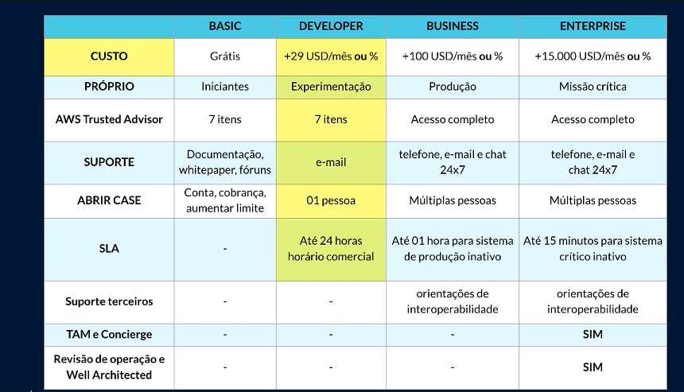</a>

## AWS Pricing Calculator
"permite explorar os serviços AWS e gerar uma estimativa de custo de seus casos de uso na AWS. Você pode organizar as suas estimativas da AWS por grupos que definir."

**[REFERENCIA](https://calculator.aws/#/)**

## AWS Cost Explorer
"aws cost explorer é uma interfaace para visualizar, entender e gerenciar os custos e o uso da AWS ao longo do tempo"
- OBS
  - AWS Const Explorer: é uma interface para visualizar, entender e gerenciar os custos e o uso da AWS ao longo do tempo
  - AWS Budgets é para definir orçamentos personalizados e enviar alertas quando o uso ou os custos excede o valor orçado

**[REFERENCIA](https://aws.amazon.com/pt/aws-cost-management/aws-cost-explorer/)**

## AWS Marktplace
"O AWS Marketplace é um catálogo digital com milhares de ofertas de fornecedores independentes de software. Você pode usar o AWS Marketplace para encontrar, testar e comprar software que pode ser executado na AWS."
## Categorias do AWS Marketplace

  <a>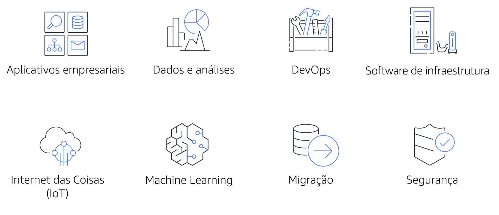</a>

**[REFERENCIA](https://aws.amazon.com/marketplace)**

## AWS Budgets
"é para definir orçamentos personalizados e enviar alertas quando o uso ou os custos excede o valor orçado.
No AWS Budgets, você pode criar orçamentos para planejar o uso do serviço, os custos de serviço e as reservas de instâncias."

**[REFERENCIA](https://aws.amazon.com/pt/aws-cost-management/)**

# 9. Migração e inovação

## Estratégias de migração

- Redefinição de hospedagem (lift-and-shift)
  - Movimentação de aplicativos sem alterações. 
- Redefinição de plataforma (lift, tinker and shift)
  - Envolver realizar algumas otimações na nuvem para obter um benefício tangível.
- Refatoração/rearquitetura (rearquitetura)
  - reimaginar como um aplicativo é arquitetado e desenvolvido usando recursos nativos da nuvem.
- Recompra
  - mudança de uma licença tradicional para um modelo de software como serviço da nuvem.
- Retenção
  - consiste em manter os aplicativos essenciais para a empresa no ambiente de origem.
- Inativação
  -  é o processo de remoção de aplicativos que não são mais necessários.

**[REFERENCIA](https://aws.amazon.com/pt/blogs/enterprise-strategy/6-strategies-for-migrating-applications-to-the-cloud/)**

## AWS Snow Family
"é uma coleção de dispositivos físicos para transporte físico de até exabytes de dados para dentro e para fora da AWS." 

- O **AWS Snowcone** é um dispositivo pequeno, robusto e seguro para transferência de dados e computação de borda.
  - 8 TB | Portátil | Lugares inóspitos | Poder Computacional

- **AWS Snowball**

  - **Snowball Edge otimizados para armazenamento** são ideais para migrações de dados de grande escala e fluxos de trabalho de transferência recorrentes, em além da computação local com necessidades maiores de capacidade. 
      - 80 TB disco rígido (HDD) para volumes de blocos
      - compatível com o Amazon S3
      - unidade de estado sólido (SSD) de 1 TB para volumes de blocos. 
      - Computação: 40 vCPUs e 80 GiB de memória para dar suporte a instâncias sbe1 do Amazon EC2 (equivalente a C5).
      ---
  - **Snowball Edge otimizado para computação** fornece recursos de computação poderosos para casos de uso, como machine learning, análise de vídeo em movimento completo, análise e pilhas de computação locais. 
      - HDD utilizável de 42 TB
      - compatível com o Amazon S3
      - compatíveis com o Amazon EBS
      - 7,68 TB de capacidade de SSD NVMe 
      - Computação: 52 vCPUs, 208 GiB de memória e uma GPU NVIDIA Tesla V100 opcional. Os dispositivos executam as instâncias sbe-c e sbe-g do Amazon EC2, que são equivalentes às instâncias C5, M5a, G3 e P3.

 - AWS Snowmobile
  "é um serviço de transferência dados na escala de exabytes usado para mover grandes quantidades de dados para a nuvem AWS."

    - Você pode transferir até 100 petabytes por Snowmobile, um contêiner de transporte reforçado com 13,71 metros de comprimento puxado por um caminhão semirreboque.

# 10. AWS Well-Architected Framework
## AWS Cloud Adoption Framework (AWS CAF)

" Ajuda você a entender como projetar e operar sistemas confiáveis, seguros, eficientes e econômicos na nuvem AWS."

  <a>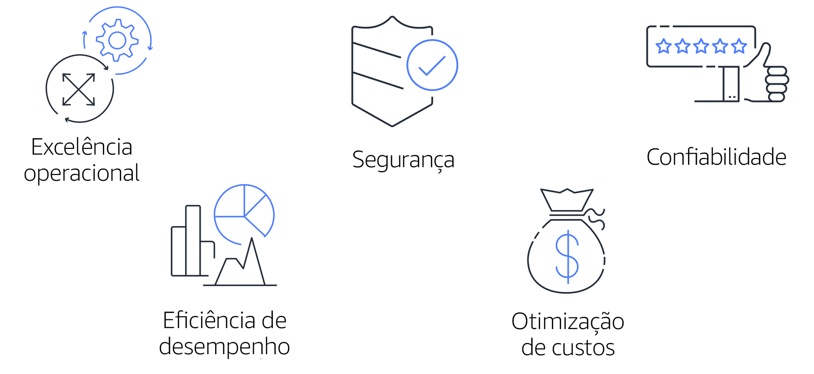</a>

- O Well-Architected Framework se baseia em cinco pilares: 

- Excelência operacional(Operational Excellence)
  - é a capacidade de executar e monitorar sistemas para entregar valor comercial e melhorar continuamente os processos e procedimentos de apoio.

- Segurança(Secucity)
  - inclui a capacidade de proteger informações, sistemas e ativos e, ao mesmo tempo, entregar valor comercial por meio de avaliações de risco e estratégias de mitigação.

- Confiabilidade(Reliability)
  - Recuperar-se de interrupções na infraestrutura ou no serviço
  - Adquirir dinamicamente recursos de computação para atender à demanda
  - Reduzir interrupções, como configurações incorretas ou problemas de rede transitórios

- Eficiência de desempenho(Performance Efficiency)
  - é a capacidade de usar recursos computacionais com eficiência para cumprir requisitos do sistema e manter essa eficiência à medida que a demanda muda e as tecnologias evoluem.
- Otimização de custos(Cost Optimization)
  - é a capacidade de executar sistemas para entregar valor comercial com o menor preço.

**[REFERENCIA](https://d1.awsstatic.com/whitepapers/architecture/AWS_Well-Architected_Framework.pdf)**
* [Topo](#topo)

